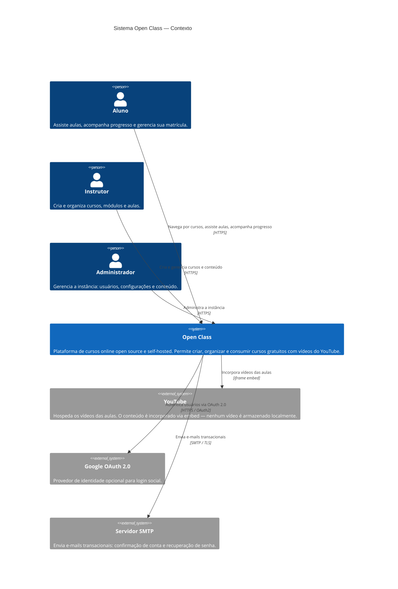
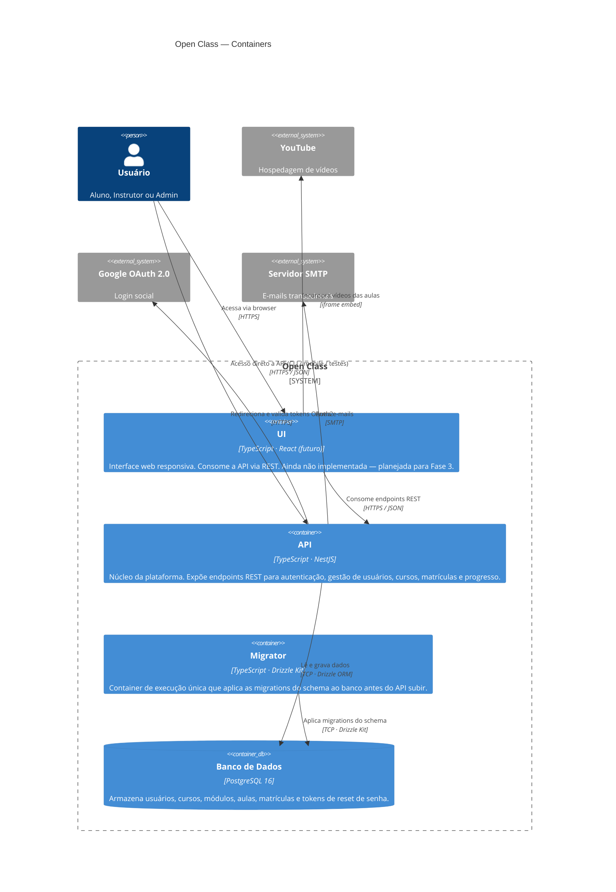
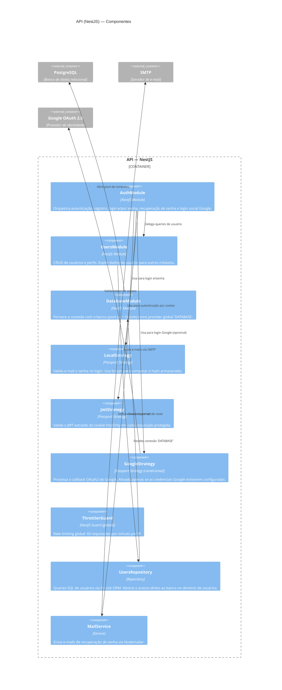
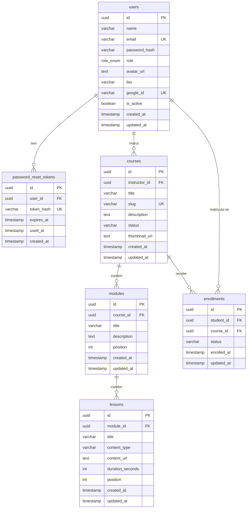

# Arquitetura — Open Class (C4 Model)

> Documentação de arquitetura seguindo o [modelo C4](https://c4model.com/): Context → Container → Component.

---

## Nível 1 — Contexto do Sistema

Visão geral de quem usa o Open Class e com quais sistemas externos ele se integra.

---

## Nível 2 — Containers

Decomposição interna do Open Class em suas unidades de deploy e processos principais.

---

## Nível 3 — Componentes da API

Decomposição interna do container **API** (NestJS) em seus módulos e responsabilidades.

---

## Schema do Banco de Dados (estado atual — Fase 1)

Entidades já implementadas e planejadas para Fase 2.

> **Legenda de status das entidades**:
> - `users`, `password_reset_tokens` — implementadas (Fase 1)
> - `courses`, `modules`, `lessons`, `enrollments` — planejadas para implementação (Fase 2 / Issue #8)

---

## Decisões de Arquitetura

| Decisão | Escolha | Justificativa |
|---------|---------|---------------|
| Autenticação | JWT stateless em cookie httpOnly | Sem estado no servidor; compatível com deploy single-instance sem Redis |
| ORM | Drizzle ORM | Type-safe, zero overhead, migrations explícitas em SQL |
| Vídeos | YouTube embed | Elimina custo e complexidade de storage de mídia |
| Deploy | Docker Compose | Self-hosted simples; target homelab < 256 MB RAM idle |
| Monorepo | pnpm workspaces + Turborepo | Compartilhamento de `packages/db` entre apps sem publicação no npm |
| Rate limiting | ThrottlerModule (in-memory) | Suficiente para < 1000 usuários; sem Redis na Fase 1 |
